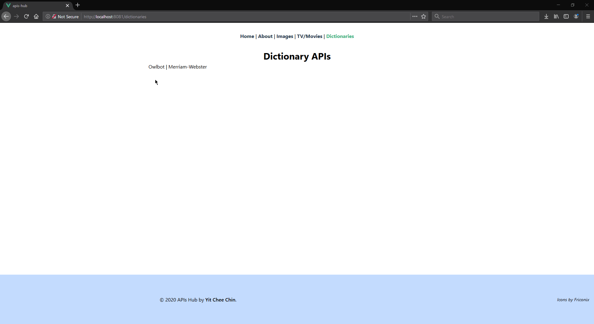

# apis-hub
A web app made with Vue.js that lets people try out a selection of APIs.  

__Current working APIs:__
- Pictures
  - Random.dog
  - Lorem Picsum
- TV / Movies
  - OMDb
  - TMDb
- Dictionaries
  - Owlbot
  - Merriam-Webster
## Demo
__Images__


__TV / Movies__


__Dictionaries__


## Project setup
```
npm install
```

### Compiles and hot-reloads for development
```
npm run serve
```

### Compiles and minifies for production
```
npm run build
```

### Lints and fixes files
```
npm run lint
```

### Customize configuration
See [Configuration Reference](https://cli.vuejs.org/config/).
